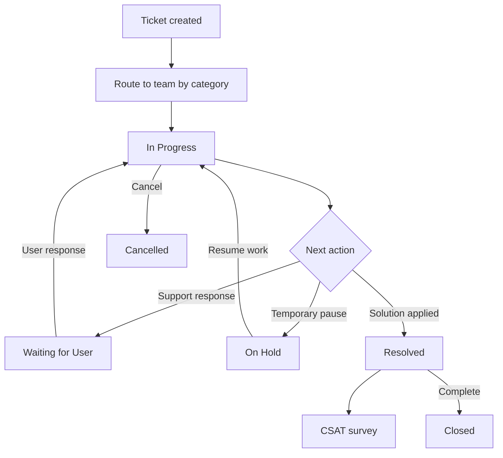
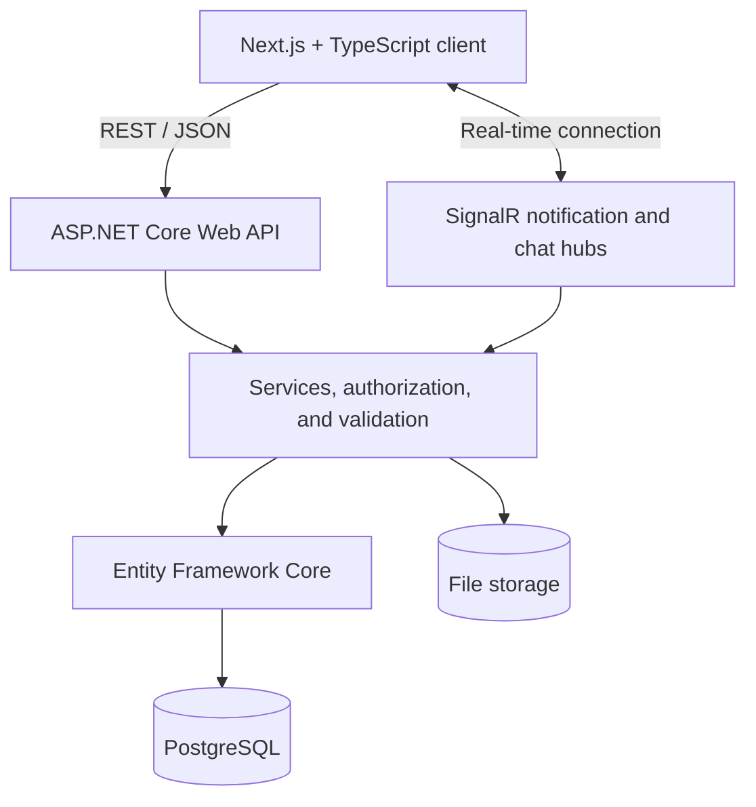
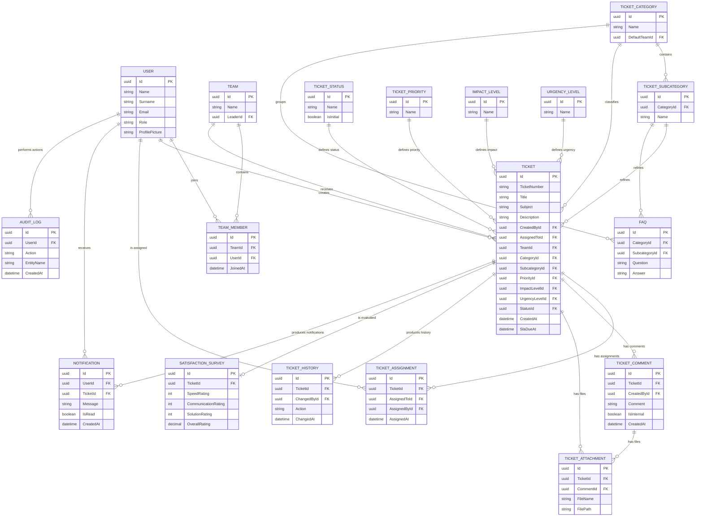

# Archipelago Help Desk Management System

An end-to-end help desk platform designed to create, route, track, and resolve
internal support requests under clearly defined service-level agreements.

[](https://nextjs.org/)
[](https://www.typescriptlang.org/)
[](https://dotnet.microsoft.com/apps/aspnet)
[](https://www.postgresql.org/)
[](https://learn.microsoft.com/aspnet/core/signalr/introduction)

## Table of Contents

- [About the Project](#about-the-project)
- [Key Features](#key-features)
- [User Roles and Permissions](#user-roles-and-permissions)
- [Ticket Lifecycle](#ticket-lifecycle)
- [SLA Management](#sla-management)
- [System Architecture](#system-architecture)
- [Data Model](#data-model)
- [Technology Stack](#technology-stack)
- [Repository Structure](#repository-structure)
- [Installation](#installation)
- [Configuration](#configuration)
- [Running the Application](#running-the-application)
- [API Modules](#api-modules)
- [CSAT Calculation](#csat-calculation)
- [Security](#security)
- [Validation and Testing](#validation-and-testing)
- [Production Deployment](#production-deployment)
- [Troubleshooting](#troubleshooting)
- [Contributing](#contributing)
- [License](#license)

## About the Project

Archipelago provides a central platform through which employees can submit
technical support requests and support teams can manage them in a controlled,
traceable workflow. It goes beyond basic ticket storage by combining
category-based team routing, role- and team-based authorization,
business-hours-aware SLA calculation, real-time notifications, team chat,
customer satisfaction surveys, and a detailed audit trail.

The project's primary goals are to:

- Turn support requests into a standardized and traceable process.
- Route tickets to the correct team based on category and subcategory data.
- Separate the responsibilities of users, support agents, team leaders, and
  administrators.
- Calculate SLA deadlines using actual working hours instead of calendar time.
- Keep comments, attachments, assignments, and status changes in one ticket
  history.
- Deliver real-time notifications and team communication through SignalR.
- Make support quality measurable through CSAT data.
- Keep administrative operations auditable through structured audit logs.

## Key Features

### Ticket Management

- Create tickets with a title, subject, and detailed description.
- Classify requests by category and optional subcategory.
- Manage priority, impact, and urgency as separate dimensions.
- Automatically route tickets to a team based on category configuration.
- Assign or reassign tickets to suitable support agents through team leaders.
- Filter by status, priority, category, date range, and search text.
- Sort by ticket number, title, creator, priority, or a custom status order.
- Allow users to track their own tickets and support agents to track tickets
  they created or were assigned.
- Separate active tickets from resolved, closed, and cancelled work.

### Comments and Attachments

- Support conversations between requesters and support agents.
- Allow authorized staff to add internal notes.
- Upload up to 10 files in a single operation.
- Preview or download supported images and documents.
- Attach files directly to a ticket or to a specific comment.
- Record comment and attachment operations in ticket history.

Supported file extensions:

```text
.jpg, .jpeg, .png, .pdf, .txt, .docx, .xlsx, .zip, .rar, .7z
```

The maximum allowed size is `100 MB` per file.

### Real-Time Notifications and Chat

- Notify the relevant team leader when a new ticket reaches a team.
- Notify a support agent when a ticket is assigned to them.
- Notify the other party when a requester or assigned agent adds a comment.
- Notify the requester when a ticket is resolved or closed.
- Warn responsible users 15 working minutes before an SLA breach.
- Track read and unread states and support marking all notifications as read.
- Provide a team chat room for team members and their leader.
- Provide a separate communication room for team leaders.
- Reload persisted notifications when a temporary connection is restored.

### Administration and Reporting

- Manage users, roles, teams, and team memberships.
- Enforce a single team leader per team.
- Safely demote a former team leader to Support Agent when their team is
  deleted.
- Manage categories, subcategories, and FAQ content.
- Manage ticket statuses, priorities, impact levels, urgency levels, and
  resolution categories.
- Assign unassigned team tickets directly from the team management page.
- Display user- and team-level ticket statistics.
- Report CSAT averages and star-based support performance.
- Filter audit logs by date and time range.
- Support both light and dark themes.

## User Roles and Permissions

| Role              | Core permissions                                                                                                                                                 |
| ----------------- | ---------------------------------------------------------------------------------------------------------------------------------------------------------------- |
| **User**          | Creates tickets; views, updates, and, where permitted, deletes their own tickets; adds comments and attachments; submits a satisfaction survey after resolution. |
| **Support Agent** | Manages tickets they created or were assigned; adds comments, internal notes, and attachments; updates status; carries out the resolution process.               |
| **Team Leader**   | Views tickets routed to their team; assigns work to team members; manages team workload, schedules, and team performance.                                        |
| **Admin**         | Accesses all tickets and administration pages; manages users, roles, teams, lookup data, FAQs, CSAT results, and audit logs.                                     |

Authorization is not limited to interface visibility. The backend evaluates
ticket ownership, active team membership, current assignment, and role data
before allowing access to protected resources.

## Ticket Lifecycle



The system uses the following core statuses:

| Status             | Description                                                                    |
| ------------------ | ------------------------------------------------------------------------------ |
| `Open`             | The ticket has not yet entered active processing.                              |
| `In Progress`      | A support team is actively working on the ticket.                              |
| `Waiting for User` | More information or a response is required from the requester.                 |
| `On Hold`          | Work is temporarily paused because of an external dependency or planned delay. |
| `Resolved`         | A solution has been applied and the ticket is ready for user evaluation.       |
| `Closed`           | The ticket workflow is fully completed.                                        |
| `Cancelled`        | The ticket will not be processed further.                                      |

A ticket automatically routed to a team through its category is moved directly
to `In Progress`. A response from the assigned support agent can move an
eligible ticket to `Waiting for User`; the requester's next response can move it
back to `In Progress`. Tickets in `On Hold` or terminal states are protected
from these automatic transitions.

## SLA Management

SLA deadlines are calculated using working time rather than calendar time. The
default work calendar is:

| Setting                    | Default value                  |
| -------------------------- | ------------------------------ |
| Time zone                  | `Europe/Istanbul`              |
| Working days               | Monday–Friday                  |
| Morning work period        | `08:00–12:00`                  |
| Afternoon work period      | `13:00–17:00`                  |
| Weekends                   | Excluded from SLA calculations |
| Leave/non-working periods  | Excluded from SLA calculations |
| Approaching-breach warning | Final 15 working minutes       |

Team leaders can manage work hours and leave days for members of their team. The
SLA timer can be paused in eligible states and resumes from the remaining
working duration when processing continues.

## System Architecture



The application separates responsibilities across the following layers:

1. **Presentation:** Next.js pages, reusable components, forms, filters, and
   role-specific interfaces.
2. **API:** Controllers that handle HTTP requests and SignalR hubs that manage
   real-time connections.
3. **Business:** Services that enforce ticket workflow, assignment, SLA,
   notification, authorization, and survey rules.
4. **Validation:** FluentValidation on the backend and Zod schemas on the
   frontend.
5. **Persistence:** PostgreSQL access, migrations, and history tracking through
   Entity Framework Core.
6. **Client communication:** An Axios-based API client and Microsoft SignalR
   client.

## Data Model

The diagram below summarizes the principal entities and their relationships.
Only identifying and relationship fields are shown to keep the diagram readable.



## Technology Stack

### Frontend

| Technology                   | Purpose                                               |
| ---------------------------- | ----------------------------------------------------- |
| **Next.js**                  | Routing, application structure, and production builds |
| **React**                    | Component-based user interface development            |
| **TypeScript**               | Type safety and safer client-side development         |
| **Tailwind CSS**             | Fast and consistent styling                           |
| **DaisyUI**                  | Theme-aware interface components                      |
| **Axios**                    | REST API requests and centralized error handling      |
| **Zod**                      | Form and client-side data validation                  |
| **Microsoft SignalR Client** | Real-time notifications and chat updates              |

### Backend

| Technology                    | Purpose                                                      |
| ----------------------------- | ------------------------------------------------------------ |
| **ASP.NET Core Web API**      | REST endpoints, middleware, and authorization infrastructure |
| **Entity Framework Core**     | ORM, relational data access, and migration management        |
| **PostgreSQL**                | Persistent relational data storage                           |
| **JWT Bearer Authentication** | Authentication and protected endpoint access                 |
| **FluentValidation**          | DTO and business input validation                            |
| **SignalR**                   | Real-time notifications and chat                             |
| **Swagger / OpenAPI**         | API documentation and manual endpoint testing                |

## Repository Structure

```text
HelpDesk-Management-System/
├── backend/
│   ├── Controllers/          # HTTP endpoints
│   ├── Data/                 # DbContext, seed data, and configurations
│   ├── DTO/                  # Request and response models
│   ├── Entities/             # Entity Framework Core entities
│   ├── Hubs/                 # SignalR hubs
│   ├── Migrations/           # Database migrations
│   ├── Services/             # Business rules and service layer
│   ├── Validators/           # FluentValidation classes
│   ├── Program.cs            # Application startup and DI registrations
│   └── appsettings*.json     # Backend configuration
├── frontend/
│   ├── public/               # Static assets
│   ├── src/
│   │   ├── app/              # Next.js pages and routes
│   │   ├── components/       # Reusable UI components
│   │   ├── contexts/         # Authentication, theme, and notification contexts
│   │   ├── services/         # Axios and SignalR clients
│   │   ├── types/            # TypeScript types
│   │   └── utils/            # Utility functions
│   ├── package.json
│   └── .env.local            # Local frontend configuration
└── README.md
```

> The structure is summarized by responsibility. Individual modules can be
> expanded within their corresponding areas as the project evolves.

## Installation

### Prerequisites

Install the following tools before running the project locally:

- Git
- A .NET SDK compatible with the backend project's `TargetFramework`
- Node.js LTS and npm
- PostgreSQL
- Entity Framework Core CLI (`dotnet-ef`)

Install the EF Core CLI if it is not already available:

```bash
dotnet tool install --global dotnet-ef
```

### 1. Prepare the Repository

Copy the repository URL from the **Code** menu on GitHub and clone it to your
local environment. Then move into the project root:

```bash
cd HelpDesk-Management-System
```

### 2. Create the PostgreSQL Database

Create an empty PostgreSQL database for the application. For example:

```sql
CREATE DATABASE helpdesk_management;
```

### 3. Install Backend Dependencies

```bash
cd backend
dotnet restore
```

### 4. Configure Backend Settings

Provide development credentials through `appsettings.Development.json`,
environment variables, or .NET User Secrets.

Example connection string:

```text
Host=localhost;Port=5432;Database=helpdesk_management;Username=postgres;Password=YOUR_PASSWORD
```

Example User Secrets configuration:

```bash
dotnet user-secrets init
dotnet user-secrets set "ConnectionStrings:DefaultConnection" "Host=localhost;Port=5432;Database=helpdesk_management;Username=postgres;Password=YOUR_PASSWORD"
dotnet user-secrets set "Jwt:Key" "LOCAL_DEVELOPMENT_ONLY_LONG_RANDOM_SECRET"
```

> Never commit a database password, JWT signing key, SMTP credential, or any
> other secret to Git.

### 5. Apply Database Migrations

```bash
dotnet ef database update
```

Even if the application is configured to run migrations during startup, applying
them explicitly during local setup makes database errors easier to detect.

### 6. Install Frontend Dependencies

Open a new terminal:

```bash
cd frontend
npm install
```

Set the API address in `frontend/.env.local`:

```env
NEXT_PUBLIC_API_URL=<backend-base-url>
```

Replace `<backend-base-url>` with the HTTPS address printed by `dotnet run`.
SignalR connections must also use an accessible backend address and the correct
hub routes.

## Configuration

### Backend Settings

Review the following setting groups in local and production environments:

| Setting                               | Description                                      |
| ------------------------------------- | ------------------------------------------------ |
| `ConnectionStrings:DefaultConnection` | PostgreSQL connection string                     |
| JWT secret/key                        | Token signing secret                             |
| JWT issuer/audience                   | Token generation and validation values           |
| CORS allowed origins                  | Trusted frontend origins                         |
| SMTP host/port/user/password          | Password reset email delivery                    |
| Upload/storage path                   | Persistent location for avatars and ticket files |
| SLA time zone/calendar                | Work hours and time zone rules                   |

The backend options classes and registrations in `Program.cs` are the source of
truth for exact configuration key names.

### Frontend Settings

- The API base URL must be an externally reachable backend address.
- The browser origin must exactly match an origin allowed by the backend CORS
  policy.
- Do not mix an HTTPS frontend with an HTTP backend.
- SignalR hub endpoints must remain reachable through the reverse proxy.

## Running the Application

### Run the Backend

```bash
cd backend
dotnet run
```

In the Development environment, Swagger is available at the `/swagger` path of
the backend address printed in the terminal.

### Run the Frontend

```bash
cd frontend
npm run dev
```

The frontend runs at the following address by default:

```text
http://localhost:3000
```

During the first run, seed logic creates active roles, ticket statuses,
priorities, and other required lookup values. Preserve the `Admin`,
`TeamLeader`, `SupportAgent`, and `User` role names when changing seed data.

## API Modules

Swagger/OpenAPI should be treated as the current source of truth for route and
model definitions. The backend is organized into the following functional areas:

| Module                  | Responsibility                                                        |
| ----------------------- | --------------------------------------------------------------------- |
| **Auth**                | Registration, login, JWT generation, profile, and password operations |
| **Tickets**             | Ticket creation, listing, details, updates, and deletion              |
| **Assignments**         | Assignment, reassignment, and unassignment                            |
| **Comments**            | Public comments and internal notes                                    |
| **Attachments**         | Multi-file upload, preview, download, and deletion                    |
| **Resolution**          | Resolution data and transitions to Resolved or Closed                 |
| **Satisfaction Survey** | CSAT submission and reporting                                         |
| **Lookup**              | Categories, subcategories, statuses, priorities, impact, and urgency  |
| **Team Management**     | Team members, unassigned work, schedules, and team performance        |
| **Admin**               | Users, roles, teams, FAQs, and system definitions                     |
| **Audit Log**           | Tracking administrative and critical operations                       |
| **Notifications**       | Persisted notifications and read status                               |
| **Team Chat**           | Team-room and team-leader-room messages                               |

## CSAT Calculation

After a ticket is resolved, the requester can provide a score from 1 to 5 for:

- Resolution speed (`SpeedRating`)
- Communication quality (`CommunicationRating`)
- Solution quality (`SolutionRating`)

The user is not asked to provide a separate overall experience score. The system
calculates it as the arithmetic mean of the three component scores:

```text
OverallRating = (SpeedRating + CommunicationRating + SolutionRating) / 3
```

These results can be used in the admin dashboard, team views, and individual
support-agent performance summaries.

## Security

- JWT-based authentication.
- Role and permission checks in controller and service layers.
- Resource-level authorization based on ticket ownership, assignment, and active
  team membership.
- Parameterized EF Core queries to reduce SQL injection risk.
- FluentValidation on the backend and Zod validation on the frontend.
- File type, count, and size restrictions.
- Audit records for sensitive operations.
- Controlled error responses instead of exposing raw exception details.
- Submission-state guards to prevent duplicate tickets or updates caused by
  repeated clicks.
- Secrets kept outside the source code.

> Client-side role checks improve the user experience but do not provide a
> security boundary. Authoritative access control must always be enforced by the
> backend.

## Validation and Testing

Validate both backend and frontend production builds before submitting a change.

### Backend Validation

```bash
cd backend
dotnet restore
dotnet build
dotnet test
```

### Frontend Validation

```bash
cd frontend
npm install
npm run build
```

Recommended end-to-end checks include:

- Login and unauthorized page/endpoint access for every role.
- Ticket creation and category-based automatic team routing.
- Assignment by a team leader and reassignment to another team.
- Automatic status transitions after requester and support-agent comments.
- Repeated submission or save actions.
- Uploading up to 10 files, invalid extensions, and file-size limits.
- SLA calculations across work periods, lunch breaks, weekends, and leave days.
- SignalR reconnection and persisted notification loading.
- CSAT submission and average calculation for a resolved ticket.
- Team membership and Team Leader role updates after team deletion.
- Badge, star, and modal appearance in light and dark themes.

## Production Deployment

Before deploying to production:

- Configure a strong, environment-specific JWT signing key.
- Supply the PostgreSQL connection string through a secret manager.
- Apply migrations as a controlled release step.
- Add the frontend address to the backend's allowed CORS origins.
- Enable WebSocket/SignalR forwarding on the reverse proxy.
- Use persistent disk or object storage for avatars and ticket attachments.
- Verify that uploaded files survive application restarts and redeployments.
- Test SMTP limits and the password-reset email flow.
- Enforce HTTPS and configure secure headers and log access policies.
- Confirm that seed operations do not overwrite existing production data.
- Build the frontend with `npm run build` and publish the backend with
  `dotnet publish`.

Example backend publish command:

```bash
cd backend
dotnet publish --configuration Release --output ./publish
```

## Troubleshooting

### Migration or Model Change Errors

```bash
cd backend
dotnet ef migrations list
dotnet ef database update
```

If the model changed without a corresponding migration, create one and update
the database:

```bash
dotnet ef migrations add <MigrationName>
dotnet ef database update
```

### SignalR Cannot Connect

- Check the frontend API and hub addresses.
- Confirm that the frontend origin is included in the backend CORS policy.
- Enable WebSocket upgrade headers on the reverse proxy.
- Check for HTTPS/HTTP mixed-content issues.
- Confirm that the JWT is passed correctly to the hub connection.

### Uploaded Avatars or Files Are Missing in Production

- Ensure files are not written to an ephemeral container filesystem.
- Use a persistent volume or object storage.
- Confirm that the backend generates a publicly accessible file URL.
- Check static-file middleware and reverse-proxy path rules.

### `Unable to Resolve Service` Error

Confirm that the corresponding interface and service implementation are
registered in `Program.cs`:

```csharp
builder.Services.AddScoped<IExampleService, ExampleService>();
```

### SMTP Delivery Errors

- Check the SMTP host, port, username, and password.
- Review the provider's per-second and daily email limits.
- Ensure an email failure does not terminate the primary application operation
  with an uncontrolled exception.

## Contributing

1. Fork the repository.
2. Create a descriptive feature branch:

   ```bash
   git checkout -b feature/short-description
   ```

3. Split changes into small, meaningful commits.
4. Run the backend and frontend build checks.
5. Push the branch and open a Pull Request.

Recommended commit format:

```text
<type>(<scope>): <short description>
```

Examples:

```text
feat(ticket): add category-based team assignment
fix(signalr): prevent duplicate notification connections
docs(readme): update local setup instructions
```

Common types include `feat`, `fix`, `docs`, `refactor`, `test`, and `chore`.

Include the following information in the Pull Request description:

- The purpose of the change.
- Affected frontend and backend modules.
- Whether a database migration is required.
- Manual test steps.
- Light- and dark-theme screenshots for UI changes.

## License

Unless a separate `LICENSE` file is added to this repository, the source code is
protected by default copyright law. Add a license appropriate to the project to
define the terms for reuse, distribution, and derivative works.

---

> **Archipelago — support requests, clearly routed and reliably resolved.**